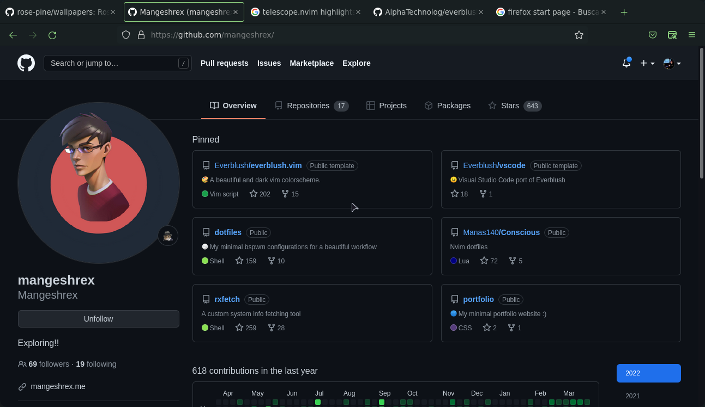

# Firefox for everblush

You need the [firefox color extension](https://color.firefox.com)

## Installation

To install simply apply the theme using the color firefox extension. Use this [link](https://color.firefox.com/?theme=XQAAAAI4AQAAAAAAAABBqYhm849SCia3ftKEGccwS-xMDPr1qJSICemUD3Pa_t3LNFRUgICrvjr9kfYBbhv6dUC0iyupqw2HrPsm8IDvxNUbHaWPJtR0tcCjhIMFXzS5j7SyCreZUfpWcJBMG0OP9XHEjhD0LTJ2PWYgG6LxQ-sJZrHRql9_0TDFfibexXkw6JTc0HBd8TvgavFv_0KFnPaYN6aEyHH3KHdUtD9b-42EBQCx_4HFuZ5uX2WtAYpxk4HnYoQAGYf_5HLsQA)
